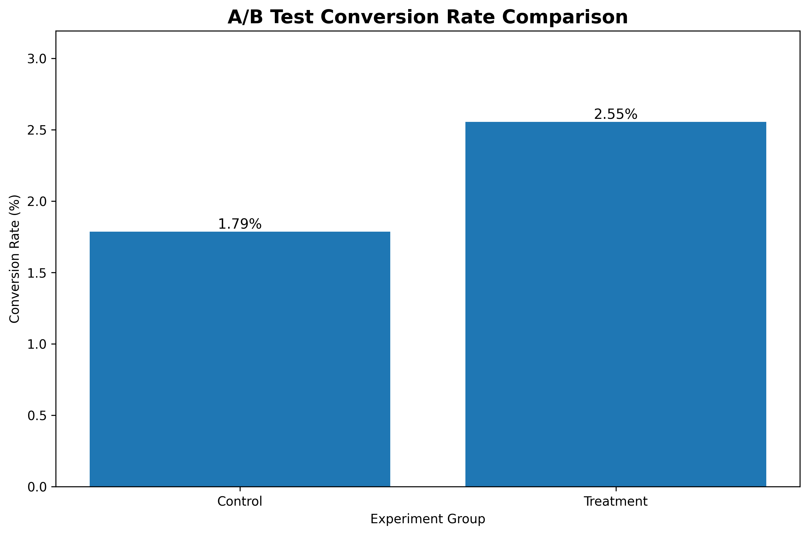

# MarketLens — A/B Testing Analysis

## 1. Experiment Overview

**Dataset:** `marketing_AB.csv`

**Purpose:** Evaluate whether the treatment group produced a different conversion rate from the control group.

**Significance level:** α = 0.05

**Confidence level:** 95%

---

## 2. Dataset Summary

| Metric | Value |
|---|---:|
| Total observations analyzed | 588,101 |
| Control observations | 23,524 |
| Treatment observations | 564,577 |
| Control conversions | 420 |
| Treatment conversions | 14,423 |

---

## 3. Conversion Performance

| Group | Sample Size | Conversions | Conversion Rate |
|---|---:|---:|---:|
| Control | 23,524 | 420 | 1.79% |
| Treatment | 564,577 | 14,423 | 2.55% |

---

## 4. Lift Analysis

### Absolute Lift

**0.77 percentage points**

### Relative Lift

**43.09%**

The treatment group shows a relative lift of 43.09% compared with control.

---

## 5. Statistical Test

### Two-Proportion Z-Test

**Z-statistic:** 7.3701

**P-value:** 0.000000

**Result:** **Statistically Significant**

The treatment group shows a statistically significant higher conversion rate than the control group.

---

## 6. 95% Confidence Interval

The estimated difference in conversion rates has the following 95% confidence interval:

**[0.60%, 0.94%]**

This interval represents the estimated uncertainty around the difference between treatment and control conversion rates.

---

## 7. Business Interpretation

The analysis compares conversion performance between the two experiment groups.

The treatment conversion rate was **2.55%**, compared with **1.79%** for the control group.

The observed difference was **0.77 percentage points**.

The statistical test returned a p-value of **0.000000**.

Therefore:

> The treatment group shows a statistically significant higher conversion rate than the control group.

The result should be interpreted together with the confidence interval, sample size, experiment design and business context before making a marketing decision.

---

## 8. Analytical Limitations

- Statistical significance does not automatically imply business significance.
- Conversion rate is only one performance measure.
- The analysis does not evaluate profitability unless revenue or profit data is available.
- External factors may affect campaign performance.
- Experiment quality depends on the underlying randomization and data collection process.
- The analysis does not estimate long-term customer value.

---

## 9. Recommended Next Questions

1. Does the treatment effect remain consistent across audience segments?
2. Does the treatment affect users differently by advertising exposure?
3. What is the relationship between ad exposure and conversion?
4. Would the observed lift justify additional testing?
5. What additional revenue or profit would the treatment generate if scaled?

---

## 10. Visualization

---

### MarketLens

**Marketing Analytics | Statistical Testing | Business Intelligence | Generative AI**

Author: **Pranoti Ashok Munjankar**
